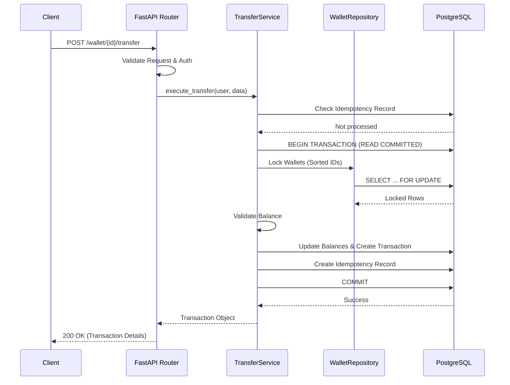
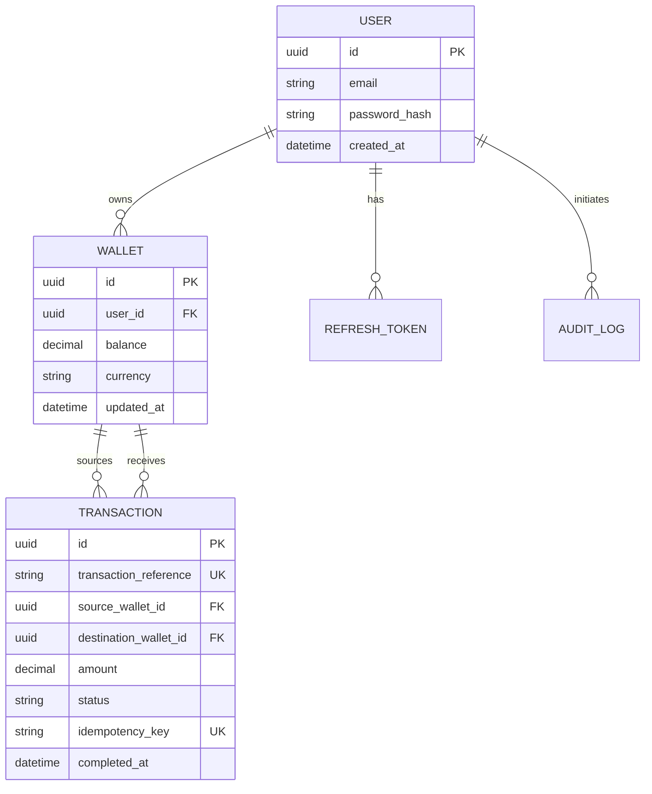

# Financial Transaction API

A production-oriented backend for managing financial transactions with high consistency, concurrency safety, and observability. Built with Python, FastAPI, PostgreSQL, and Redis.

## 🚀 Key Features

*   **Wallet Management**: Create and track multiple wallets per user.
*   **Atomic Transfers**: Correct money transfers with pessimistic row-level locking.
*   **Durable Idempotency**: Guaranteed replay safety using PostgreSQL-backed idempotency records.
*   **JWT Auth**: Secure authentication with refresh token rotation.
*   **Structured Observability**: JSON logging, correlation IDs, and latency tracking.
*   **Concurrency Safe**: Explicit deadlock prevention and race-condition protection.
*   **Production Ready**: Dockerized setup with dependency ordering and health checks.

## 🛠 Tech Stack

*   **Language**: Python 3.11
*   **Framework**: FastAPI (Asynchronous)
*   **Database**: PostgreSQL (ACID compliant)
*   **Caching/Rate Limiting**: Redis
*   **ORM**: SQLAlchemy 2.0 (Async)
*   **Migrations**: Alembic
*   **Testing**: Pytest

## 🏗 Architecture

The project follows a **Modular Monolith** pattern with a strictly defined layered architecture:

1.  **Router Layer**: API entry points, request/response validation (Pydantic).
2.  **Service Layer**: Business logic, transaction orchestration, and cross-domain validation.
3.  **Repository Layer**: Encapsulated database access and ORM interactions.

### Request Flow Diagram



## 🔐 Concurrency & Consistency Strategy

### Why Pessimistic Locking?
We chose **Pessimistic Row-Level Locking** (`SELECT ... FOR UPDATE`) over Optimistic Locking (versioning) for the following reasons:
*   **Consistency over Throughput**: In financial systems, the cost of an incorrect balance update is far higher than the cost of slight latency during high contention.
*   **Strict Serializability**: It prevents "lost updates" and "skewed reads" by ensuring only one process can modify a wallet at any given time.
*   **Simplified Failure Modes**: Transactions wait for the lock rather than failing and requiring complex client-side retry logic.

### Deadlock Prevention
To prevent deadlocks when locking two wallets (A -> B and B -> A simultaneously), we always lock wallets in a **fixed order** (sorted by UUID). This ensures that concurrent transfers between the same two wallets always acquire locks in the same sequence.

### Durable Idempotency
Idempotency keys are stored in **PostgreSQL** rather than Redis.
*   **Why?** To ensure **Transactional Atomicity**. The idempotency record is created within the same database transaction as the transfer itself. If the commit fails, the idempotency record is not created, allowing for a safe retry.
*   **Replay Behavior**: If a request is re-sent with the same key, the system returns the *identical* response from the database without re-executing the logic.

## 🗄 Database Schema



## 🚦 Local Setup

1.  **Clone the repository**:
    ```bash
    git clone https://github.com/yourusername/financial-transaction-api.git
    cd financial-transaction-api
    ```

2.  **Environment Variables**:
    Create a `.env` file (or use defaults in `docker-compose.yml`):
    ```env
    POSTGRES_USER=postgres
    POSTGRES_PASSWORD=postgres
    POSTGRES_DB=finapi
    SECRET_KEY=your_secret_key
    ```

3.  **Run with Docker**:
    ```bash
    docker-compose up --build
    ```

4.  **Access the API**:
    *   API: `http://localhost:8000`
    *   Docs: `http://localhost:8000/docs`

## 🧪 Testing

The test suite includes unit, integration, and concurrency tests.

```bash
# Run all tests
pytest

# Run concurrency tests specifically (Requires Postgres)
pytest tests/test_transfer.py::test_concurrent_transfers
```

*Note: The concurrency test skips automatically if running on SQLite due to lack of `FOR UPDATE` support.*

## 📈 Observability

*   **Structured Logs**: All logs are output in JSON format for easy ingestion by ELK/Splunk.
*   **Correlation IDs**: Every request is assigned a `X-Correlation-ID` header, which is propagated through all logs.
*   **Audit Logging**: Critical actions (transfers, auth failures) are recorded in the `audit_logs` table with metadata.

## 🚧 Future Improvements

*   **Cross-Currency Support**: Integration with an FX provider or a stored rate table.
*   **Advanced Rate Limiting**: Token bucket algorithm for more granular control.
*   **Outbox Pattern**: For reliable event propagation to external systems (e.g., notifying a user via email).
*   **Metrics**: Prometheus integration for monitoring throughput and error rates.

---
*Built with practical production mindset. Focused on correctness over buzzwords.*
