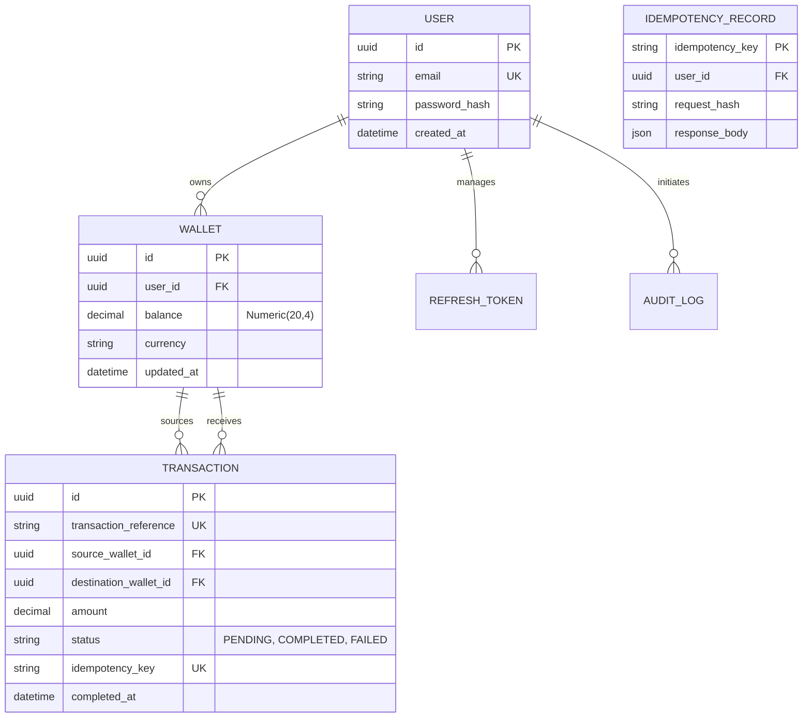

# Financial Transaction API (FinAPI)

[](https://www.python.org/)
[](https://fastapi.tiangolo.com/)
[](https://www.postgresql.org/)
[](https://redis.io/)
[](https://www.docker.com/)

FinAPI is a high-performance, production-ready financial transaction backend designed with a "correctness-first" engineering mindset. Unlike basic CRUD banking demos, this project focuses on solving core backend challenges: **transactional integrity**, **concurrency handling**, **idempotency**, and **observability**.

## 🏗 Architectural Philosophy

The system is built as a **Modular Monolith** using a strictly layered architecture to ensure separation of concerns and maintainability.

### 🛡️ Core Engineering Decisions

1.  **PostgreSQL Pessimistic Locking**: 
    - **Choice**: We use `SELECT ... FOR UPDATE` for all money transfers.
    - **Rationale**: In financial systems, consistency is non-negotiable. While optimistic locking (versioning) offers higher throughput, pessimistic locking prevents "lost updates" and complex client-side retry logic during high contention.
    - **Deadlock Prevention**: Locks are always acquired in a deterministic order (sorted by UUID) to eliminate circular wait conditions.

2.  **Durable Transactional Idempotency**:
    - **Choice**: Idempotency records are stored in PostgreSQL within the same ACID transaction as the transfer.
    - **Rationale**: Storing idempotency in Redis (common in tutorials) creates a "split authority" problem. If the DB commit fails but Redis succeeds, the request can never be safely retried. By tying them to the DB transaction, we guarantee that either both the transfer and the idempotency record persist, or neither does.

3.  **Observability as a First-Class Citizen**:
    - **Choice**: Structured JSON logging and Request Correlation IDs.
    - **Rationale**: Debugging concurrent systems requires tracing requests across logs. Every log entry includes a `correlation_id` and latency metrics, making the system ready for ELK/Splunk ingestion.

4.  **Refresh Token Rotation**:
    - **Choice**: State-stored JWT refresh tokens with single-use invalidation.
    - **Rationale**: Standard JWTs are stateless and hard to revoke. By storing the hash of refresh tokens in PostgreSQL and rotating them on every use, we provide a secure way to revoke access without sacrificing the performance of stateless access tokens.

---

## 🗄️ Database Schema

The schema is optimized for relational integrity and indexed for high-performance lookups.



---

## 🚀 Getting Started

### Prerequisites
*   Docker & Docker Compose
*   Python 3.11+ (for local development)

### Local Development (with Docker)
The easiest way to run the full stack (API, PostgreSQL, Redis) is using Docker Compose:

```bash
# 1. Clone and enter
git clone https://github.com/whitebeard10/FinAPI.git
cd FinAPI

# 2. Start services
docker-compose up --build
```

The API will be available at `http://localhost:8000`.
Interactive Swagger docs: `http://localhost:8000/docs`.

### Environment Configuration
Key configurations can be adjusted in `.env`:
*   `POSTGRES_SERVER`: Database host
*   `REDIS_HOST`: Redis host for rate-limiting
*   `SECRET_KEY`: JWT signing key
*   `ACCESS_TOKEN_EXPIRE_MINUTES`: Token TTL

---

## 🧪 Testing and Quality Assurance

Testing is critical for verifying concurrency logic. We use **Pytest** with `asyncio` support.

```bash
# Set PYTHONPATH to project root
export PYTHONPATH=$PYTHONPATH:.

# Run all tests
pytest
```

### Verified Scenarios:
- [x] **Concurrent Transfers**: Ensures that firing 10 simultaneous transfers from the same wallet results in exactly the correct final balance.
- [x] **Idempotency Replay**: Verifies that duplicate requests return the same response without deducting balance twice.
- [x] **Auth Guards**: Ensures private endpoints are protected by JWT and rate-limited.

---

## 📈 Observability

Example of a structured log generated during a transfer:
```json
{
  "event": "transfer_completed",
  "reference": "TXN-B79593EF9E95",
  "amount": 100.0,
  "correlation_id": "276c5d90-107e-4d99-9f41-d0cd6a7732b2",
  "duration": "0.0461s",
  "level": "info",
  "timestamp": "2026-05-22T10:46:59.942Z"
}
```

---

## 🚧 Roadmap & Improvements
- [ ] **FX Integration**: Support for cross-currency transfers using live exchange rates.
- [ ] **Outbox Pattern**: Implementation of the Outbox pattern for reliable event-driven notifications.
- [ ] **Prometheus Metrics**: Exposing `/metrics` for scraping by Grafana.
